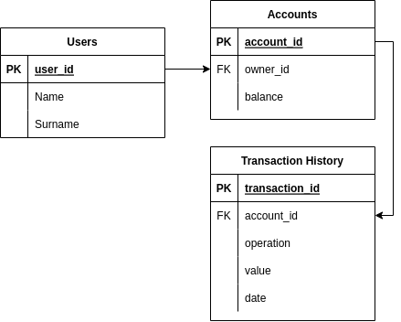

# Transaction System

## Usage
POST request on:
 - Decrease balance: http://localhost:8080/{user-id}/account/dec
 - Increase balance: http://localhost:8080/{user-id}/account/inc

Request body:
```json
{
  "amount": 1234
}
```

## Deployment
1. "make up" in ./deployment directory
2. Migrate DB schema (./deployment/schema.sql)
3. Profit

## Requirements
- Docker Compose
- GNU Make
- PostgreSQL client to migrate DB schema

## DB schema


## Basics
<b>TransactionQueueManager</b> enqueues and processes transactions using a buffered chanel. It also has <b>HistoryStorage</b> and <b>AccountStorage</b> interfaces to make a queue processing independent from the data storage, which makes code more testable and flexible.

Every initialization of a new <b>TransactionQueueManager</b> through "constructor" <b>NewTransactionQueueManager</b> a transaction history is loaded from the storage through <b>HistoryStorage</b> interface realization.

Every successful transaction will be stored in <b>HistoryStorage</b> and <b>TransactionQueueManager.TransactionHistory</b> array.